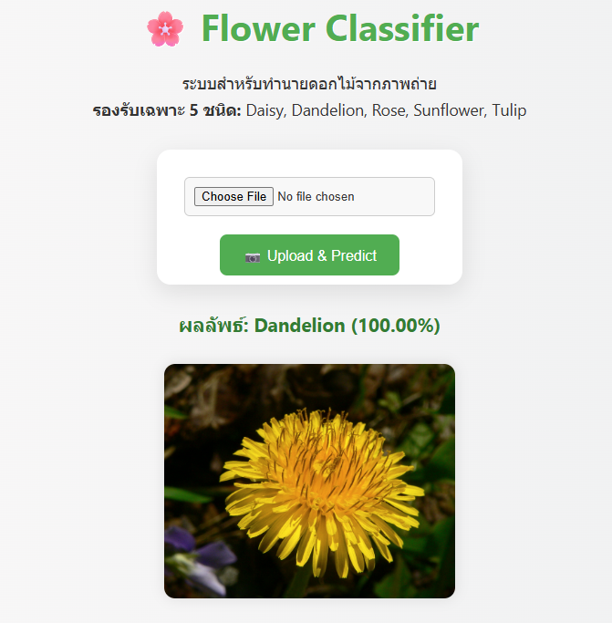

# 🌸 Flower Classifier Web App

แอปเว็บที่ใช้ **FastAPI** และ **TensorFlow** เพื่อให้ผู้ใช้สามารถอัปโหลดรูปภาพดอกไม้ แล้วระบบจะทำนายประเภทของดอกไม้

> โดยเรียนรู้และพัฒนาจาก [GeeksForGeeks - Flower Recognition using CNN](https://www.geeksforgeeks.org/flower-recognition-using-convolutional-neural-network/)

> **ดอกไม้ที่รองรับ:** Daisy, Dandelion, Rose, Sunflower, Tulip

---

## 📁 โครงสร้างโปรเจกต์
```
flower_recognition/
├── train_model/
│ ├── flowers/ # ชุดข้อมูลสำหรับฝึก
│ ├── model.ipynb # Notebook สำหรับเทรนโมเดล
│ └── Model.h5 # โมเดลที่ฝึกเสร็จแล้ว
│
└── web_page/
├── main.py # Backend (FastAPI)
├── Model.h5 # โมเดลพร้อมใช้งาน
├── templates/
│ └── index.html # หน้าเว็บ
├── static/
│ └── style.css # CSS
└── uploads/ # รูปที่อัปโหลด
```
---

## 🧠 สรุปโมเดล

โมเดลเป็น CNN 4 ชั้น Convolution + MaxPooling ตามด้วย Dense Layer และ Softmax Output

- Input: รูปขนาด 224x224
- Output: 5 ประเภทดอกไม้
- Accuracy: `97.14%` (train), `68.37%` (validation)

---

## 🧪 การติดตั้ง

### 1. สร้าง virtual environment (แนะนำ)
```bash
conda create -n flowerenv python=3.10 -y
conda activate flowerenv
```
### 2. ติดตั้งไลบรารีที่จำเป็น
```
pip install fastapi uvicorn jinja2 tensorflow keras pillow
```

## 🚀 การใช้งาน
### 1. เข้าโฟลเดอร์เว็บ
```
cd web_page
```
### 2. เรียกใช้งาน FastAPI
```
uvicorn main:app --reload
```
### 3. เปิดเบราว์เซอร์ที่:
```
http://localhost:8000
```
### 4. อัปโหลดรูป แล้วดูผลลัพธ์!

<p>ภาพดอกไม้จาก <a href="https://en.wikipedia.org/wiki/Taraxacum#/media/File:DandelionFlower.jpg" target="_blank">Wikimedia Commons</a></p>

## 📌 หมายเหตุ
- ไฟล์ที่อัปโหลดจะถูกเก็บในโฟลเดอร์ /uploads

- แนะนำให้ลบรูปอัปโหลดทิ้งหลังใช้งาน เพื่อไม่ให้เก็บไฟล์เก่าไว้ในระบบ

- หากนำไปใช้ในระบบจริง ควรเพิ่มระบบความปลอดภัย เช่น validation, ไฟล์จำกัดขนาด